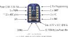
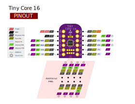
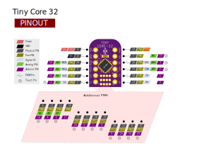
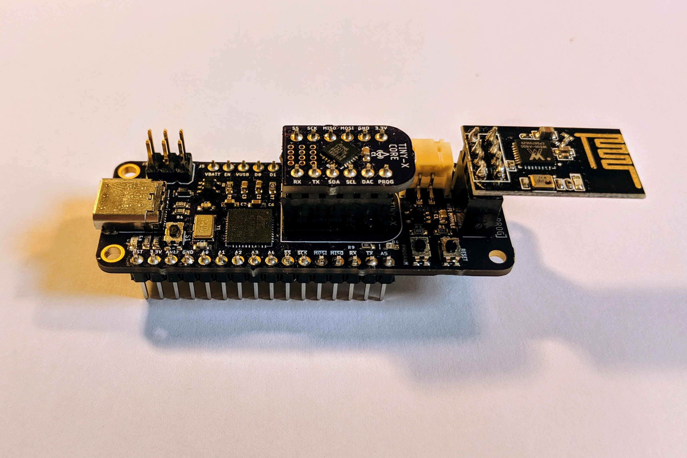

===============
Getting Started
===============

Board Intro
-----------

TinyCore Series include TinyCore 16 (Attiny1616 breakout board), TinyCore 32 (Attiny3217 breakout board) and TinyCore Programmer.
TinyCore is miniature prototpying board with common peripherals like I2C, SPI, UART.
It also has PWM, Timers, Touch PINS, ADC, DAC, 16K / 32K Flash, 2K SRAM, 256 bytes EEPROM with 8-bit CPU running up to 20MHz all in its tiny body! 
It has Arduino Support and open source libraries.
They are maker & hacker friendly.

======================   ======================
Specifications           .
======================   ======================
Flash (program memory)   32/16 KB    
RAM                      2 KB
EEPROM                   256 bytes
Bootloader               No
GPIO Pins                18
ADC Channels             10
PWM Channels             3
Peripheral               USART, SPI, I2C, Touch
Clock                    Up to 20 MHz
Power Consumption        min 2.9μA, max 10mA
======================   ======================

Below is the overview of the TinyCore 16 Breakout Board:



TinyCore 16 Pinout
``````````````````


TinyCore 32 Pinout
``````````````````


Installation
------------
**Hardware:**
    * Solder Header pins on both TinyCore 16/32 and TinyCore Programer.
    * Plug in TinyCore 16 or 32
    * Plug in Optional ESP8266 or W600 module
    * Connect a USB-C cable and plug into your computer



**Software Through Arduino IDE:**
    * Install the current upstream Arduino IDE at the 1.8.7 level or later. The current version is at the `Arduino Website`_.
    * Start Arduino and open Preferences window.
    * Enter ``https://raw.githubusercontent.com/xukangmin/TinyCore/master/avr/package/package_tinycore_index.json``
      into *Additional Board Manager URLs* field. You can add multiple URLs, separating them with commas.
    * Open Boards Manager from Tools > Board menu and install *TinyCore* platform (and don't forget to select your TinyCore board from Tools > Board menu after installation).


.. _`Arduino Website`: http://www.arduino.cc/en/main/software


Blink!
------

A LED on the TinyCore Programmer board is connected to the DAC pin marked on the board silkscreen, copy below code to Arduino IDE and upload sketch:

**Blink Code:**

.. code-block:: c

    void setup() {
        // initialize digital pin LED_BUILTIN as an output.
        pinMode(LED_BUILTIN, OUTPUT);
    }

    // the loop function runs over and over again forever
    void loop() {
        digitalWrite(LED_BUILTIN, HIGH);   // turn the LED on (HIGH is the voltage level)
        delay(1000);                       // wait for a second
        digitalWrite(LED_BUILTIN, LOW);    // turn the LED off by making the voltage LOW
        delay(1000);                       // wait for a second
    }

Compile & Upload
--------

Select Board TinyCore 16 or TinyCore 32 in the board manager and click and compile the code.

There are several ways to upload sketches.
    * Upload through TinyCore Programmer
        * Select related com port number and click upload directly, same as programming Arduino Uno
    * Upload through Arduino Uno or similar boards.
        * Connect Arduno Uno and Tiny Core boards as described `here`_.
        * Arduin IDE->Tools->Programmer->Arduino PIN as UPDI
        * Arduin IDE->Sketch->Upload using programer
    * Upload through `Atmel-ICE Programmer`_
        * Connect Atmel-ICE UPDI, VTG and GND PIN to TinyCore, supply TinyCore with external voltage, either 3.3V or 5V.
        * Make sure the green light on Atmel-ICE is on, that means target is properly powered
        * Arduin IDE->Tools->Programer->Atmel-ICE-UPDI
        * Arduin IDE->Sketch->Upload using programer

.. _`Atmel-ICE Programmer`: https://www.microchip.com/DevelopmentTools/ProductDetails/ATATMEL-ICE
.. _`here`: https://github.com/ElTangas/jtag2updi


You should see an orange LED blinking on the TinyProgrammer Board. 

**Now You officially start your TinyCore Journal, Congratulations!**